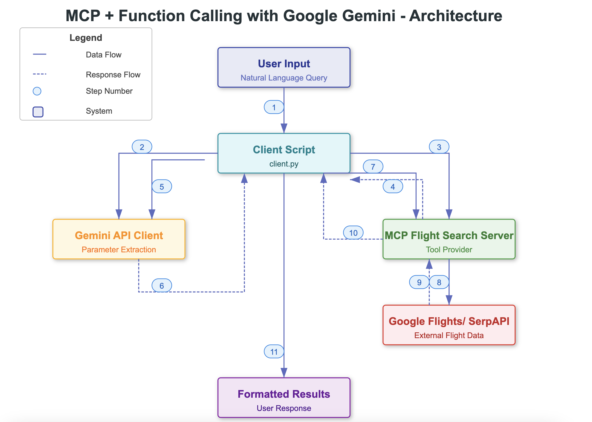
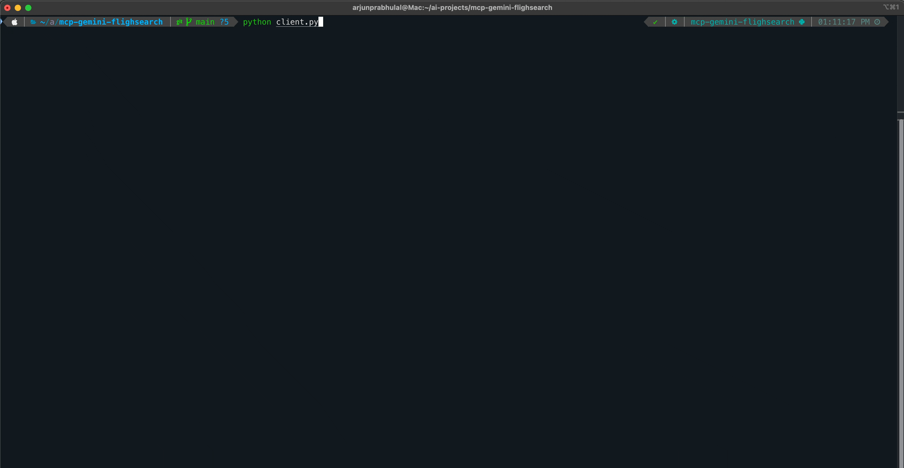

# Gemini Function Calling + Model Context Protocol(MCP) Flight Search



This project demonstrates how to use Google's Gemini API with function calling capabilities to interact with the `mcp-flight-search` tool via Model Context Protocol (MCP). This client implementation shows how to:

1.  Connect to a local MCP server process (`mcp-flight-search`) using stdio communication
2.  Use natural language prompts with Gemini to search for flights (e.g., "Find flights from Atlanta to Las Vegas on 2025-05-05")
3.  Let Gemini automatically determine the correct function parameters from the natural language input
4.  Execute the flight search using the MCP tool
5.  Display formatted results from the search

## Features

*   Natural language flight search using Gemini API
*   Automatic parameter extraction via function calling
*   Integration with `mcp-flight-search` tool via stdio
*   Formatted JSON output of flight results
*   Environment-based configuration for API keys

## Prerequisites

Before running this client, you'll need:

1.  Python 3.7+
2.  A Google AI Studio API key for Gemini
3.  A SerpAPI key (used by the flight search tool)
4.  The `mcp-flight-search` package installed

## Dependencies

This project relies on several Python packages:

*   **google-generativeai**: Google's official Python library for accessing Gemini and other Google AI models.
    - Provides the client interface for Gemini API
    - Handles function calling capabilities
    - Manages API authentication and requests

*   **mcp-sdk-python**: Model Context Protocol (MCP) SDK for Python.
    - Provides `ClientSession` for managing MCP communication
    - Includes `StdioServerParameters` for configuring server processes
    - Handles tool registration and invocation

*   **mcp-flight-search**: A flight search service built with MCP.
    - Implements flight search functionality using SerpAPI
    - Provides MCP-compliant tools for flight searches
    - Handles both stdio and HTTP communication modes

*   **asyncio**: Python's built-in library for writing asynchronous code.
    - Manages asynchronous operations and coroutines
    - Handles concurrent I/O operations
    - Required for MCP client-server communication

*   **json**: Python's built-in JSON encoder and decoder.
    - Parses flight search results
    - Formats output for display
    - Handles data serialization/deserialization

## Setup

1.  **Clone the Repository:**
    ```bash
    git clone https://github.com/arjunprabhulal/mcp-gemini-search.git
    cd mcp-gemini-search
    ```

2.  **Install Dependencies:**
    ```bash
    # Install required Python libraries
    pip install -r requirements.txt
    # Install the MCP flight search tool
    pip install mcp-flight-search
    ```

3.  **Set Environment Variables:**
    ```bash
    export GEMINI_API_KEY="YOUR_GEMINI_API_KEY"
    export SERP_API_KEY="YOUR_SERPAPI_API_KEY"
    ```
    Replace the placeholder values with your actual API keys:
    *   Get your Gemini API key from [Google AI Studio](https://aistudio.google.com/app/apikey)
    *   Get your SerpAPI key from [SerpApi](https://serpapi.com/manage-api-key)

## Architecture

This project integrates multiple components to enable natural language flight search. Here's how the system works:

### Component Interactions

1. **User to Client**
   - User provides natural language query (e.g., "Find flights from Atlanta to Las Vegas tomorrow")
   - Client script (`client.py`) processes the input

2. **Client to MCP Server**
   - Client starts the MCP server process (`mcp-flight-search`)
   - Establishes stdio communication channel
   - Retrieves available tools and their descriptions

3. **Client to Gemini API**
   - Sends the user's query
   - Provides tool descriptions for function calling
   - Receives structured function call with extracted parameters

4. **Client to MCP Tool**
   - Takes function call parameters from Gemini
   - Calls appropriate MCP tool with parameters
   - Handles response processing

5. **MCP Server to SerpAPI**
   - MCP server makes requests to SerpAPI
   - Queries Google Flights data
   - Processes and formats flight information

### Data Flow

1. **Input Processing**
   ```
   User Query → Natural Language Text → Gemini API → Structured Parameters
   ```

2. **Flight Search**
   ```
   Parameters → MCP Tool → SerpAPI → Flight Data → JSON Response
   ```

3. **Result Handling**
   ```
   JSON Response → Parse → Format → Display to User
   ```

### Communication Protocols

1. **Client ↔ MCP Server**
   - Uses stdio communication
   - Follows MCP protocol for tool registration and calls
   - Handles asynchronous operations

2. **MCP Server ↔ SerpAPI**
   - HTTPS requests
   - JSON data exchange
   - API key authentication

3. **Client ↔ Gemini API**
   - HTTPS requests
   - Function calling protocol
   - API key authentication

### Error Handling

The integration includes error handling at multiple levels:
- Input validation
- API communication errors
- Tool execution failures
- Response parsing issues
- Data formatting problems

## Usage

Run the client:
```bash
python client.py
```

The script will:
1.  Start the MCP flight search server process
2.  Send your flight search query to Gemini
3.  Use Gemini's function calling to extract search parameters
4.  Execute the search via the MCP tool
5.  Display the formatted results

### Example Output



## Related Projects

This client uses the `mcp-flight-search` tool, which is available at:
*   GitHub: [arjunprabhulal/mcp-flight-search](https://github.com/arjunprabhulal/mcp-flight-search)
*   PyPI: [mcp-flight-search](https://pypi.org/project/mcp-flight-search/)

## Author

For more articles on AI/ML and Generative AI, follow me on Medium: [@arjun-prabhulal](https://medium.com/@arjun-prabhulal)

## License

This project is licensed under the MIT License. 